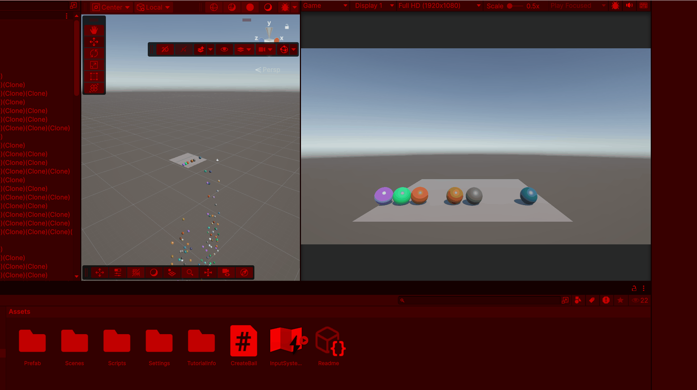
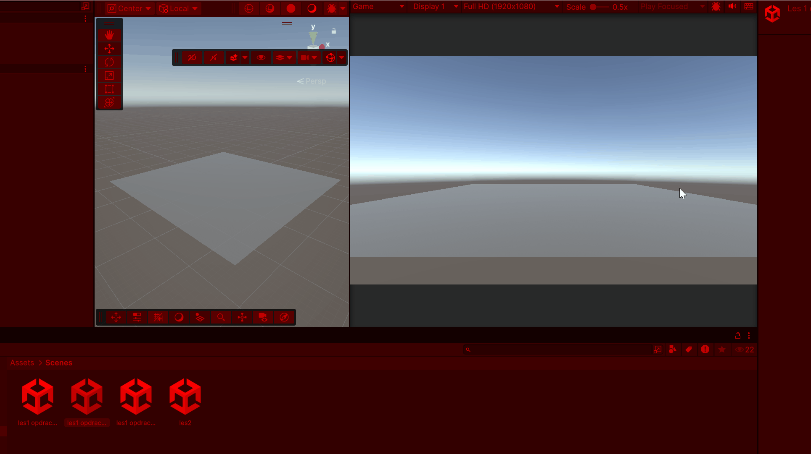
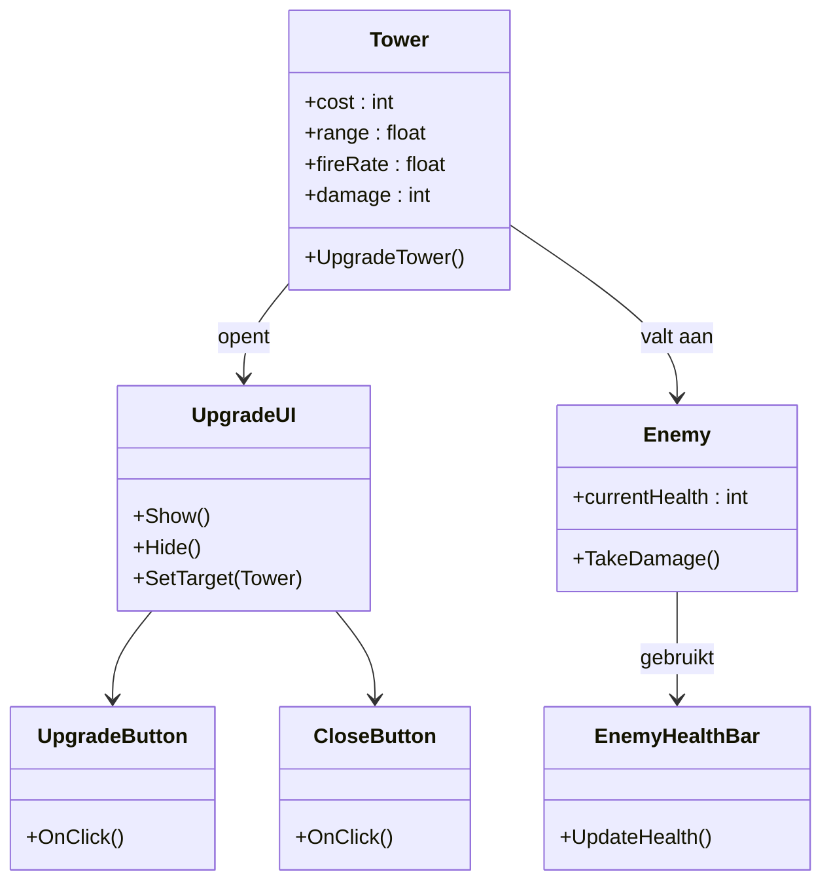
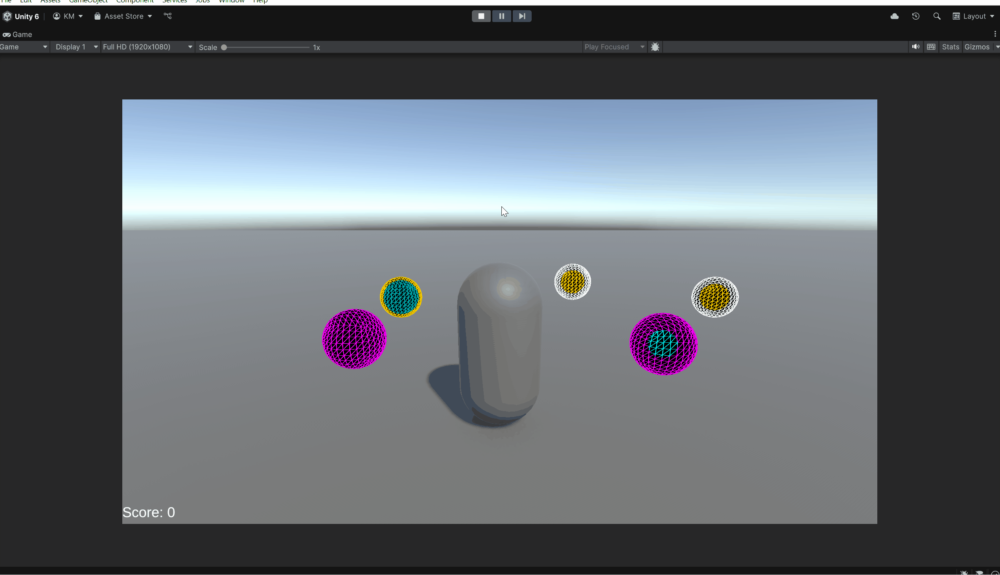
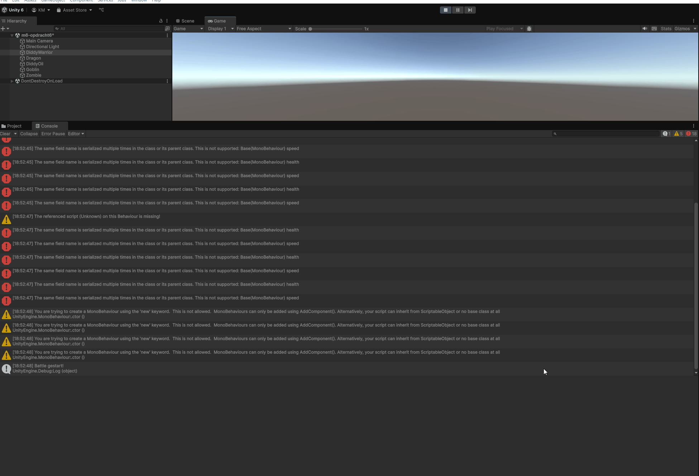

# GD-M5-PROG

## Les1 opdracht1

Scripts: https://github.com/BadTimeForU/GD-M5-PROG/blob/main/Assets/CreateBall.cs
Ik heb hier ballen met willekeurige kleuren en dat hij start met 1 bal en word steeds meer.

## Les1 opdracht2

Scripts: https://github.com/BadTimeForU/GD-M5-PROG/blob/main/Assets/Scripts/Tower.cs
         https://github.com/BadTimeForU/GD-M5-PROG/blob/main/Assets/Scripts/TowerSpawner.cs
Ik heb hier als je klikt dat het op een random plek komt op de platform.

## Les1 opdracht3

Scripts: https://github.com/BadTimeForU/GD-M5-PROG/blob/main/Assets/Scripts/Enemy.cs
         https://github.com/BadTimeForU/GD-M5-PROG/blob/main/Assets/Scripts/EnemySpawner.cs
Ik Heb hier blokjes die exploderen en de camera gaat steeds een beetje achteruit.

## Les2

Scripts: https://github.com/BadTimeForU/GD-M5-PROG/blob/main/Assets/Scripts/Player.cs
         https://github.com/BadTimeForU/GD-M5-PROG/blob/main/Assets/Scripts/Scoreboard.cs
         https://github.com/BadTimeForU/GD-M5-PROG/blob/main/Assets/Scripts/Pickup.cs
als je cirkel aanraakt dat score omhoog gaat.

## Les4 Opdracht6

Scripts: https://github.com/BadTimeForU/GD-M5-PROG/blob/main/Assets/Space48-main/Assets/Scripts/ShipController.cs
https://github.com/BadTimeForU/GD-M5-PROG/blob/main/Assets/Space48-main/Assets/Scripts/ShipHealth.cs
https://github.com/BadTimeForU/GD-M5-PROG/blob/main/Assets/Space48-main/Assets/Scripts/ShipShield.cs
https://github.com/BadTimeForU/GD-M5-PROG/blob/main/Assets/Space48-main/Assets/Scripts/ShipShooter.cs
https://github.com/BadTimeForU/GD-M5-PROG/blob/main/Assets/Space48-main/Assets/Scripts/ShipUIManager.cs
https://github.com/BadTimeForU/GD-M5-PROG/blob/main/Assets/Space48-main/Assets/Scripts/Shipinventory.cs
ik heb me best geprobeert maar hij draait hem maar ik heb wel de SRP gedaan.

## Les4 opdracht7

Scripts: https://github.com/BadTimeForU/GD-M5-PROG/blob/main/Assets/Scripts/LaserBehaviour.cs
https://github.com/BadTimeForU/GD-M5-PROG/blob/main/Assets/Scripts/Movement.cs
https://github.com/BadTimeForU/GD-M5-PROG/blob/main/Assets/Scripts/ShipBehaviour.cs
Heb de SRP hier bij gebruikt.

## Les5

Scripts: https://github.com/BadTimeForU/GD-M5-PROG/blob/main/Assets/EnemyParent.cs
https://github.com/BadTimeForU/GD-M5-PROG/blob/main/Assets/Brute.cs
https://github.com/BadTimeForU/GD-M5-PROG/blob/main/Assets/Elf.cs
zoals je kan zien kan ik de lopende blokje met mijn kogels schieten.

## Les6 opdracht9

Scripts: https://github.com/BadTimeForU/M5-Skill-STEM/blob/main/Assets/Ball.cs

Dependecy-lijst: 
Dependencies

class Ball:
Vector3 velocity read & write
Vector3 acceleration read & write

ik heb bij deze opdracht een andere project gebruikt dus de projecten die we bij sjollema doen, want de BO Tower Defense die ik heb gemaakt hebben veel scripts en ik kom dan uit met weinig tijd en dan haal ik het niet dus ik heb het maar zo gedaan.

# GD-M6-PROG

## Les 1 - Code Conventies

Scripts: https://github.com/BadTimeForU/GD-M5-PROG/blob/main/Assets/Scripts/m6/InventoryItem.cs
https://github.com/BadTimeForU/GD-M5-PROG/blob/main/Assets/Scripts/m6/InventorySystem.cs
https://github.com/BadTimeForU/GD-M5-PROG/blob/main/Assets/Scripts/m6/Keycard.cs
https://github.com/BadTimeForU/GD-M5-PROG/blob/main/Assets/Scripts/m6/Medipack.cs
https://github.com/BadTimeForU/GD-M5-PROG/blob/main/Assets/Scripts/m6/Weapon.cs

ik heb hier zo als je kunt zien  beter code strucuur voor gebruikt en je ziet bijv. dat als je op m drukt dat medicaks eruit komt

## Les 2 - Class Diagrams

## Les 3 - Data Structures

Scripts: https://github.com/BadTimeForU/GD-M5-PROG/blob/main/Assets/Scripts/m6/Opdracht3/Inventory.cs
         https://github.com/BadTimeForU/GD-M5-PROG/blob/main/Assets/Scripts/m6/Opdracht3/Item.cs
         https://github.com/BadTimeForU/GD-M5-PROG/blob/main/Assets/Scripts/m6/Opdracht3/ItemStats.cs
         https://github.com/BadTimeForU/GD-M5-PROG/blob/main/Assets/Scripts/m6/Opdracht3/ItemTemplate.cs
         https://github.com/BadTimeForU/GD-M5-PROG/blob/main/Assets/Scripts/m6/Opdracht3/ItemType.cs

Assets: https://github.com/BadTimeForU/GD-M5-PROG/blob/main/Assets/Scripts/m6/Opdracht3/Zwaard.asset
        https://github.com/BadTimeForU/GD-M5-PROG/blob/main/Assets/Scripts/m6/Opdracht3/ChestPlate.asset
        https://github.com/BadTimeForU/GD-M5-PROG/blob/main/Assets/Scripts/m6/Opdracht3/HealingPotion.asset

ik heb deze opdracht gemaakt ik heb een zwaard met stats toegevoeg, chestplate en healing potion.

## Les 4 - Delegates

Scripts: https://github.com/BadTimeForU/GD-M5-PROG/blob/main/Assets/Scripts/m6/Opdracht4/Collectible.cs
         https://github.com/BadTimeForU/GD-M5-PROG/blob/main/Assets/Scripts/m6/Opdracht4/PlayerMove.cs
         https://github.com/BadTimeForU/GD-M5-PROG/blob/main/Assets/Scripts/m6/Opdracht4/ScoreManager.cs
         https://github.com/BadTimeForU/GD-M5-PROG/blob/main/Assets/Scripts/m6/Opdracht4/ScoreUI.cs

zoals je kan zien heb ik een player gemaakt die balletjes kan oppakken waardoor de score omhoog gaat in de textmeshpro.

## Les 5 - Abstraction

Scripts: https://github.com/BadTimeForU/GD-M5-PROG/blob/main/Assets/Scripts/m6/opdracht5/Collectable.cs
https://github.com/BadTimeForU/GD-M5-PROG/blob/main/Assets/Scripts/m6/opdracht5/CollectibleManager.cs
https://github.com/BadTimeForU/GD-M5-PROG/blob/main/Assets/Scripts/m6/opdracht5/DamageTrap.cs
https://github.com/BadTimeForU/GD-M5-PROG/blob/main/Assets/Scripts/m6/opdracht5/HealthPickup.cs

## Les 6 - Polymohism

Scripts: https://github.com/BadTimeForU/GD-M5-PROG/blob/main/Assets/BattleManager.cs
https://github.com/BadTimeForU/GD-M5-PROG/blob/main/Assets/enemy.cs
https://github.com/BadTimeForU/GD-M5-PROG/blob/main/Assets/Scripts/m6/opdracht6/Dragon.cs
https://github.com/BadTimeForU/GD-M5-PROG/blob/main/Assets/Scripts/m6/opdracht6/Goblin.cs
https://github.com/BadTimeForU/GD-M5-PROG/blob/main/Assets/Scripts/m6/opdracht6/Zombie.cs

## Les 7 - early returns

Scripts: https://github.com/BadTimeForU/GD-M5-PROG/blob/main/Assets/Scripts/m6/m6-opdracht7.cs